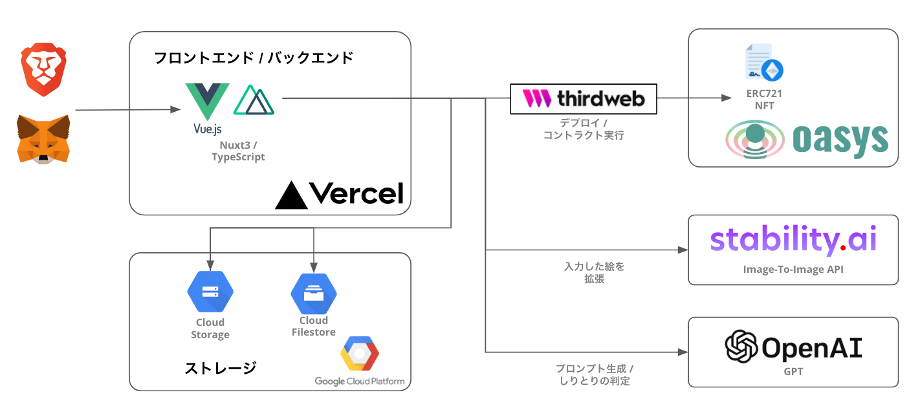

# 超絵しりとり！

超絵しりとり！のソースコードです。本アプリケーションのデモ環境には下記の URL からアクセスしてください

- [超絵しりとり！](https://oasys-tokyo-hackjam.vercel.app/?vercelToolbarCode=YHS2cuSjMs_GqNy)

本アプリケーションの操作方法や概要については下記の URL を参照してください

- [超絵しりとり！ | AKINDO](https://app.akindo.io/communities/Be7rL1wo7UEqv60G/products/Nm1V8pmL6s1ROng4)

> **Note**
> デモ用の Web サイトのため、上記のエンドポイントは予告なく終了する可能性があります。

## 全体構成

超絵しりとり！の全体構成は下記の図の通り。



## 環境

本アプリケーションは、下記の環境で動作確認をしている。

- Node.js v16.x.x
- npm v8.x.x

> **Warning**
> Node.js v18.x.x を利用した場合では、stability.ai の API リクエスト時に、原因不明のエラーが発生し安定しませんでした。その為、Node.js v16.x.x での動作を推奨します。

### スマートコントラクト

検証環境で利用しているコントラクトは、Oasys のテストネット上にデプロイされているコントラクトを利用している。

- [Oasys(Test hub Layer)にデプロイされたコントラクトのブロックエクスプローラー](https://scan.testnet.oasys.games/token/0xa38e3D0e9635A1B4b027425A130B3662E3A7f1Df)

## Quick Start

### 1. 必要情報の取得

はじめに下記のサービスにアクセスし、利用に必要な情報を取得する。

| サービス名       | URL                                 | 必要な情報                         |
| ---------------- | ----------------------------------- | ---------------------------------- |
| OpenAI           | https://beta.openai.com/            | API キー                           |
| Stability AI API | https://beta.dreamstudio.ai/account | API キー                           |
| Wallet Connect   | https://walletconnect.org/          | プロジェクト ID                    |
| Google Cloud     | https://console.cloud.google.com/   | サービスアカウントキー, バケット名 |

#### 1-1. `.env`の作成

`.env.example`をコピーして、`.env`を作成する。その後、それぞれのサービスから取得した情報を`.env`に設定する。

```bash
# 本アプリケーションがデプロイされるURL
BASE_URL=localhost:3000

# Generative AIの設定
OPENAI_API_KEY=${OpenAIのAPIキー}
DREAMSTUDIO_API_KEY=${StabilityAIのAPIキー}

# WALLET CONNECTの設定
WALLET_CONNECT_PROJECT_ID=${WALLET CONNECTのプロジェクトID}

# OASYSネットワーク, NFTコントラクトの設定
PICTURE_SHIRITORI_COMPLETE_NFT_CONTRACT_ADDRESS=0xa38e3D0e9635A1B4b027425A130B3662E3A7f1Df
BLOCK_EXPLORER_URL=https://scan.testnet.oasys.games/token/

# Google Cloudのサービスアカウントの暗号化キー
# README.mdの1-2の手順を参考に暗号化キーを作成する
DECRYPT_KEY=${1-2の手順で出力されたkeyの値}
DECRYPT_IV=${1-2の手順で出力されたivの値}
ENCRYPTED_KEY=${1-2の手順で出力されたencrypted.txtの中身}
```

#### 1-2. GCP の Service Account Key の暗号化

本アプリケーションは Vercel 上で動作しているが、Vercel は設定ファイルのアップロードに対応していないため、GCP の Service Account Key の情報を環境変数として設定できる様にする必要がある。

そのため、まずはじめに GCP からダウンロードした認証情報(`service-account-key.json`)を、下記のコマンドで暗号化する。

```bash
openssl enc -aes-256-cbc -a -in service-account-key.json -out encrypted.txt -k passphrase -p

salt=xxxxxxxxxxxxxxxx
key=xxxxxxxxxxxxxxxxxxxxxxxxxxxxxxxxxxxxxxxxxxxxxxxxxxxxxxxxxxxxxxxx
iv=xxxxxxxxxxxxxxxxxxxxxxxxxxxxxxxx
```

出力された key と iv、 `encrypted.txt`の内容を、それぞれ .env に設定する。

```bash
~省略~
DECRYPT_KEY=${1-2の手順で出力されたkeyの値}
DECRYPT_IV=${1-2の手順で出力されたivの値}
ENCRYPTED_KEY=${1-2の手順で出力されたencrypted.txtの中身}
```

以上で事前準備は完了となる。初回のみこちらの手順を行う必要がある。

### 2. サーバの起動

必要ライブラリをインストール。

```bash
npm install
```

開発用サーバを起動する。

```bash
npm run dev
```

#### 2-1. デプロイ環境の起動

デプロイ環境の起動は、下記のコマンドで行う。

```bash
npm run preview
```
